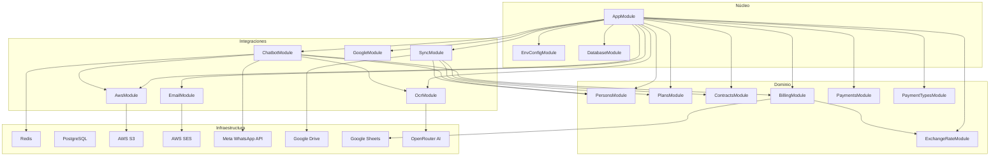
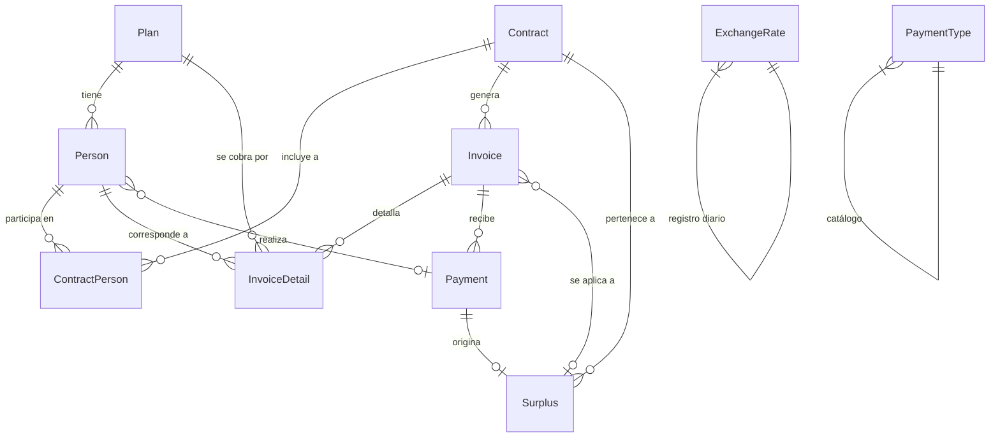
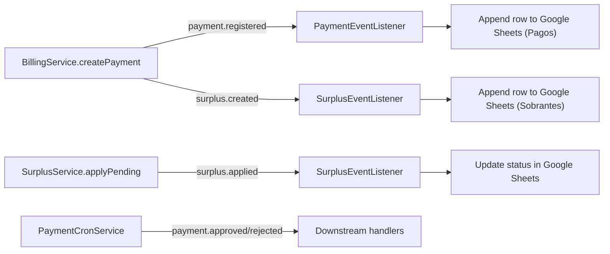
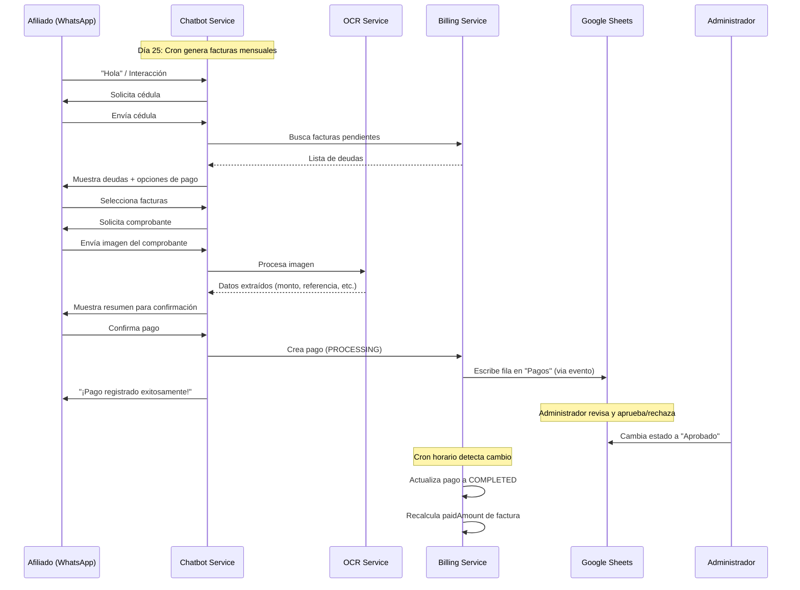

# PRD — Sistema de Plan de Salud SIRCA (`sis-sirca`)

> **Versión:** 1.0 · **Fecha:** 2026-04-14 · **Autor:** Alberto Basabe · **Estado:** Documentación

---

## 1. Visión General

**sis-sirca** es el backend del Sistema de Plan de Salud SIRCA, una plataforma diseñada para administrar planes de salud, contratos, facturación mensual automática, cobros, y comunicación con afiliados a través de un chatbot de WhatsApp. El sistema opera en Venezuela y maneja moneda dual (USD y Bolívares) con tasas de cambio del BCV.

### 1.1 Objetivos del Producto

| # | Objetivo | Descripción |
|---|----------|-------------|
| 1 | **Gestión de afiliados** | Registrar personas, asignarles planes de salud y vincularlas a contratos |
| 2 | **Facturación automática** | Generar facturas mensuales para cada contrato activo basadas en los planes de sus afiliados |
| 3 | **Cobros multi-canal** | Registrar pagos vía chatbot de WhatsApp o endpoint REST, con soporte para transferencias, Zelle y pago móvil |
| 4 | **Reconciliación automatizada** | Sincronizar estados de pagos y sobrantes con Google Sheets como panel de control administrativo |
| 5 | **OCR inteligente** | Extraer datos de comprobantes de pago automáticamente usando Tesseract + IA (OpenRouter/DeepSeek) |
| 6 | **Sincronización de datos** | Importar datos maestros de afiliados desde un archivo Excel en Google Drive |

---

## 2. Alcance Funcional

### 2.1 Dentro del alcance (In-scope)

- CRUD de personas, planes, contratos, tipos de pago
- Generación automática de facturas mensuales (cron)
- Registro de pagos con comprobante (imagen)
- Chatbot de WhatsApp (Meta Cloud API v25) con flujos interactivos encriptados
- OCR de comprobantes con validación por IA
- Gestión de sobrantes (surplus) con auto-aplicación a facturas futuras
- Sincronización bidireccional con Google Sheets (pagos ↔ estados)
- Importación de datos desde Google Drive (Excel)
- Correos de confirmación via AWS SES
- Almacenamiento de archivos en AWS S3
- Tasa de cambio diaria (USD/EUR/BS) desde BCV

### 2.2 Fuera del alcance (Out-of-scope)

- Autenticación/autorización de usuarios (no hay módulo auth actualmente)
- Panel de administración frontend
- Pasarela de pago en línea (solo registro de pagos manuales)
- Reportes y analytics

---

## 3. Arquitectura Técnica

### 3.1 Stack Tecnológico

| Capa | Tecnología |
|------|-----------|
| **Runtime** | Node.js + TypeScript |
| **Framework** | NestJS v10 |
| **Base de datos** | PostgreSQL (TypeORM v0.3) |
| **Cache/Estado** | Redis (ioredis) |
| **Almacenamiento** | AWS S3 |
| **Email** | AWS SES |
| **Chatbot** | Meta WhatsApp Cloud API v25 |
| **OCR** | Tesseract.js + OpenRouter (DeepSeek v3.2) |
| **Hojas de cálculo** | Google Sheets API v4 |
| **Almacenamiento de archivos** | Google Drive API |
| **Tareas programadas** | @nestjs/schedule (cron) |
| **Eventos** | @nestjs/event-emitter |
| **Validación** | class-validator + class-transformer |
| **Linting** | ESLint + Prettier + Husky |
| **Testing** | Jest + Supertest |

### 3.2 Diagrama de Módulos



---

## 4. Modelo de Datos

### 4.1 Diagrama Entidad-Relación



### 4.2 Detalle de Entidades

#### `Person` — Persona / Afiliado
| Campo | Tipo | Descripción |
|-------|------|-------------|
| `id` | UUID (PK) | Identificador único |
| `typeIdentityCard` | Enum: `V, E, P, J, G, C, PN` | Tipo de documento de identidad |
| `identityCard` | VARCHAR(50) | Número de documento (unique junto con tipo) |
| `name` | VARCHAR(255) | Nombre completo |
| `birthDate` | DATE | Fecha de nacimiento |
| `gender` | BOOLEAN | Género |
| `plan` | FK → Plan | Plan de salud asignado |
| `status` | Enum: `ACTIVE, INACTIVE` | Estado del afiliado |
| `createdAt / updatedAt / deletedAt` | TIMESTAMP | Auditoría + soft delete |

#### `Plan` — Plan de Salud
| Campo | Tipo | Descripción |
|-------|------|-------------|
| `id` | UUID (PK) | Identificador único |
| `name` | VARCHAR(255) | Nombre del plan |
| `maxAge` | INT | Edad máxima permitida |
| `amount` | DECIMAL(10,2) | Monto mensual en USD |
| `createdAt / updatedAt / deletedAt` | TIMESTAMP | Auditoría + soft delete |

#### `Contract` — Contrato
| Campo | Tipo | Descripción |
|-------|------|-------------|
| `id` | UUID (PK) | Identificador único |
| `code` | VARCHAR(255) UNIQUE | Código de contrato |
| `affiliationDate` | DATE | Fecha de afiliación |
| `monthlyAmount` | DECIMAL(10,2) | Monto mensual total (calculado) |
| `status` | Enum: `ACTIVE, INACTIVE` | Estado del contrato |

#### `ContractPerson` — Relación Contrato ↔ Persona
| Campo | Tipo | Descripción |
|-------|------|-------------|
| `id` | UUID (PK) | Identificador único |
| `contract` | FK → Contract | Contrato asociado |
| `person` | FK → Person | Persona asociada |
| `role` | Enum: `TITULAR, AFILIADO` | Rol dentro del contrato |

> **Constraint:** UNIQUE(`contract`, `person`)

#### `Invoice` — Factura Mensual
| Campo | Tipo | Descripción |
|-------|------|-------------|
| `id` | UUID (PK) | Identificador único |
| `contract` | FK → Contract | Contrato asociado |
| `billingMonth` | VARCHAR(7) | Mes de facturación (`YYYY-MM`) |
| `issueDate` | DATE | Fecha de emisión |
| `dueDate` | DATE | Fecha de vencimiento |
| `totalAmount` | DECIMAL(10,2) | Monto total (≥ 0) |
| `paidAmount` | DECIMAL(10,2) | Monto pagado (0 ≤ paidAmount ≤ totalAmount) |
| `status` | Enum: `PENDING, PARTIAL, PAID, CANCELLED` | Estado de la factura |

> **Constraints:** CHECK(`totalAmount ≥ 0`), CHECK(`paidAmount ≥ 0`), CHECK(`paidAmount ≤ totalAmount`), UNIQUE(`contract`, `billingMonth`)

#### `InvoiceDetail` — Detalle de Factura
| Campo | Tipo | Descripción |
|-------|------|-------------|
| `id` | UUID (PK) | Identificador único |
| `invoice` | FK → Invoice (CASCADE) | Factura padre |
| `person` | FK → Person | Persona facturada |
| `plan` | FK → Plan | Plan cobrado |
| `chargedAmount` | DECIMAL(10,2) | Monto cobrado |

#### `Payment` — Pago
| Campo | Tipo | Descripción |
|-------|------|-------------|
| `id` | UUID (PK) | Identificador único |
| `invoice` | FK → Invoice | Factura asociada |
| `person` | FK → Person (nullable) | Persona que pagó |
| `paymentDate` | TIMESTAMP | Fecha del pago |
| `amount` | DECIMAL(10,2) | Monto en USD |
| `amountBs` | DECIMAL(10,2) | Monto en Bolívares (nullable) |
| `url` | VARCHAR(255) | URL del comprobante en S3 |
| `paymentMethod` | VARCHAR(50) | Método de pago |
| `referenceNumber` | VARCHAR(100) | Número de referencia |
| `status` | Enum: `PROCESSING, COMPLETED, REJECTED` | Estado del pago |

#### `Surplus` — Sobrante
| Campo | Tipo | Descripción |
|-------|------|-------------|
| `id` | UUID (PK) | Identificador único |
| `amountBs` | DECIMAL(10,2) | Monto sobrante en Bs (nullable) |
| `amountUsd` | DECIMAL(10,2) | Monto sobrante en USD (nullable) |
| `date` | TIMESTAMP | Fecha del sobrante |
| `payment` | FK → Payment | Pago que originó el sobrante |
| `invoice` | FK → Invoice (nullable) | Factura donde se aplicó |
| `contract` | FK → Contract | Contrato asociado |
| `status` | Enum: `pending, applied, refunded, cancelled` | Estado |

#### `ExchangeRate` — Tasa de Cambio
| Campo | Tipo | Descripción |
|-------|------|-------------|
| `uuid` | UUID (PK) | Identificador único |
| `date` | DATE (UNIQUE) | Fecha de la tasa |
| `rateUsd` | DECIMAL(10,2) | Tasa USD/BS |
| `rateEur` | DECIMAL(10,2) | Tasa EUR/BS |

#### `PaymentType` — Tipo de Pago
| Campo | Tipo | Descripción |
|-------|------|-------------|
| `id` | UUID (PK) | Identificador único |
| `name` | VARCHAR(255) | Nombre (ej: "Zelle", "Pago Móvil") |
| `currency` | VARCHAR(10) | Moneda (`USD`, `BS`) |
| `datos` | JSONB | Datos adicionales (ej: cuentas bancarias) |
| `isActive` | BOOLEAN | Si está activo |

---

## 5. Módulos y Funcionalidades

### 5.1 PersonsModule — Gestión de Personas

- **CRUD completo** de personas/afiliados
- Validación de unicidad por `typeIdentityCard` + `identityCard`
- Tipos de documento: V (Venezolano), E (Extranjero), P (Pasaporte), J (Jurídico), G (Gobierno), C (Comunal), PN (Permiso)
- Soft delete con `deletedAt`

### 5.2 PlansModule — Planes de Salud

- **CRUD completo** de planes
- Cada plan define: nombre, edad máxima, monto mensual en USD
- Relación 1:N con personas

### 5.3 ContractsModule — Contratos

- **CRUD completo** de contratos
- Código único por contrato
- Tabla pivote `ContractPerson` con roles TITULAR/AFILIADO
- Cálculo de `monthlyAmount` basado en la suma de planes de afiliados activos

### 5.4 BillingModule — Facturación

#### Generación de facturas (Cron: día 25 de cada mes)
1. Itera todos los contratos activos en chunks de 100
2. Para cada contrato, obtiene los afiliados activos con rol `AFILIADO`
3. Calcula el total sumando el `amount` del plan de cada afiliado
4. Crea la factura con detalles por persona/plan
5. Aplica sobrantes pendientes a la nueva factura
6. Idempotente: constraint UNIQUE(`contract`, `billingMonth`) previene duplicados

#### Registro de pagos
1. Valida que la factura exista y reciba los datos del pago
2. Busca la tasa de cambio si el pago es en Bolívares
3. Crea el pago con estado `PROCESSING`
4. Si el pago excede la deuda → crea un `Surplus` (sobrante)
5. Recalcula `paidAmount` y actualiza el estado de la factura
6. Emite eventos: `payment.registered`, `surplus.created`
7. Sube el comprobante a S3

#### Reconciliación de pagos (Cron: cada hora)
1. Lee filas de la hoja "Pagos" en Google Sheets
2. Compara el estado de la hoja (Pendiente/Aprobado/Rechazado) con la BD
3. Actualiza el estado del pago en la BD si hay transición
4. Recalcula `paidAmount` de la factura afectada
5. Emite eventos `payment.approved` o `payment.rejected`

#### Reconciliación de sobrantes (Cron: diario a las 6:00 AM)
1. Lee filas de la hoja "Sobrantes" en Google Sheets
2. Sincroniza estados: Pendiente → Aplicado → Reembolsado → Anulado

#### Auto-aplicación de sobrantes
- Cuando se crea una nueva factura, busca sobrantes pendientes del contrato
- Aplica sobrantes secuencialmente hasta cubrir la factura o agotar sobrantes
- Si un sobrante excede la deuda restante → crea un nuevo sobrante por el remanente
- Conversión USD ↔ Bs usando tasa del día
- Todo en una transacción con locks pesimistas

### 5.5 ChatbotModule — WhatsApp Bot

#### Arquitectura
- **Webhook GET** (`/chatbot/webhook`): Verificación del webhook de Meta
- **Webhook POST** (`/chatbot/webhook`): Recepción de mensajes (protegido por `MetaSignatureGuard`)
- **Flow Endpoint** (`/chatbot/flow-endpoint`): Procesamiento de flujos interactivos encriptados

#### Flujo conversacional (estado en Redis, TTL 24h)
```
INICIO → AWAITING_NAME → AWAITING_RECEIPT / AWAITING_FLOW_INTERACTION
  → AWAITING_CAPTURE (OCR del comprobante)
  → AWAITING_CONFIRMATION (confirmación del usuario)
  → Registro del pago → FIN
```

#### Capacidades
- Consulta de deudas pendientes por cédula
- Envío de comprobantes de pago (imagen)
- OCR automático del comprobante con validación por IA
- Selección de facturas a pagar (botones interactivos)
- Confirmación del pago con resumen
- Flujos interactivos encriptados de WhatsApp (AES-GCM)
- Mensajes de texto, botones interactivos, y flujos de WhatsApp Flows

### 5.6 OCR Module — Reconocimiento de Comprobantes

1. **Tesseract.js**: Extrae texto plano de la imagen del comprobante (idioma: español)
2. **OpenRouter (DeepSeek v3.2)**: Analiza el texto con IA para extraer datos estructurados:
   - Monto, referencia, beneficiario, banco destino, fecha, origen, descripción, nombre del banco, moneda

### 5.7 PaymentsModule — Envío de Pagos (Legacy/Web)

- Endpoint REST para enviar comprobantes de pago
- Sube imagen a S3 y envía email de confirmación
- Independiente del flujo de facturación (legacy)

### 5.8 ExchangeRateModule — Tasas de Cambio

- Almacena tasas diarias USD y EUR contra Bolívares
- Script externo (`script/crontab/bcv-scraper.js`) obtiene la tasa del BCV
- Servicio para consultar la tasa por fecha

### 5.9 SyncModule — Sincronización de Datos

- **Cron: cada hora**
- Descarga un archivo Excel desde Google Drive
- Limpia y normaliza los datos (cédulas, fechas, nombres)
- Crea/actualiza personas, planes y contratos en la BD
- Gestiona roles TITULAR/AFILIADO automáticamente

### 5.10 GoogleModule — Google APIs

| Servicio | Funcionalidad |
|----------|--------------|
| `GoogleDriveService` | Descarga archivos de Google Drive |
| `GoogleSheetsService` | Lee/escribe filas, actualiza estados en hojas de cálculo |

#### Hojas de Google Sheets
- **Pagos** (columnas): Contrato, Nombre, Fecha, Hora, Referencia, Monto$, MontoBs, URL, Estado, PaymentID
- **Sobrantes** (columnas): Fecha, Hora, Contrato, Monto$, MontoBs, URL, Estado, Referencia, SurplusID

### 5.11 AwsModule — AWS Services

| Servicio | Uso |
|----------|-----|
| **S3** | Almacenamiento de comprobantes de pago (folder `receipts/`) |
| **SES** | Envío de emails de confirmación de pago |

### 5.12 PaymentTypesModule — Catálogo de Métodos de Pago

- CRUD de tipos de pago (Zelle, Pago Móvil, Transferencia, etc.)
- Cada tipo tiene: nombre, moneda, datos JSONB (cuentas bancarias), estado activo/inactivo

---

## 6. Sistema de Eventos

El sistema usa `@nestjs/event-emitter` para desacoplar la lógica de negocio de las integraciones:



| Evento | Emisor | Listener | Acción |
|--------|--------|----------|--------|
| `payment.registered` | `BillingService` | `PaymentEventListener` | Escribe fila en hoja "Pagos" |
| `surplus.created` | `BillingService` / `SurplusService` | `SurplusEventListener` | Escribe fila en hoja "Sobrantes" |
| `surplus.applied` | `SurplusService` | `SurplusEventListener` | Actualiza estado a "Aplicado" en Sheets |
| `payment.approved` | `PaymentCronService` | — | Emitido tras transición en Sheets |
| `payment.rejected` | `PaymentCronService` | — | Emitido tras transición en Sheets |

---

## 7. Tareas Programadas (Cron Jobs)

| Servicio | Expresión Cron | Descripción |
|----------|---------------|-------------|
| `BillingCronService` | `0 0 25 * *` (día 25, 00:00) | Genera facturas mensuales para todos los contratos activos |
| `PaymentCronService` | Cada hora (`EVERY_HOUR`) | Sincroniza estados de pagos desde Google Sheets |
| `SurplusCronService` | `0 6 * * *` (diario, 06:00) | Sincroniza estados de sobrantes desde Google Sheets |
| `SyncService` | Cada hora (`EVERY_HOUR`) | Importa datos de Excel desde Google Drive a la BD |
| `bcv-scraper.js` | Externo (crontab) | Scraping de tasa de cambio BCV |

---

## 8. Endpoints API

### 8.1 Chatbot

| Método | Ruta | Descripción |
|--------|------|-------------|
| `GET` | `/chatbot/webhook` | Verificación del webhook de Meta |
| `POST` | `/chatbot/webhook` | Recepción de mensajes de WhatsApp |
| `POST` | `/chatbot/flow-endpoint` | Procesamiento de flujos encriptados |

### 8.2 Pagos (Legacy)

| Método | Ruta | Descripción |
|--------|------|-------------|
| `POST` | `/payments/submit` | Envío de comprobante de pago (multipart/form-data) |

### 8.3 Facturación

| Método | Ruta | Descripción |
|--------|------|-------------|
| Interno | — | Registro de pagos desde chatbot vía `BillingService.createPayment()` |

### 8.4 Recursos (CRUD)

Los siguientes módulos exponen endpoints REST estándar:

| Controlador | Ruta Base | Operaciones |
|-------------|-----------|-------------|
| `PersonsController` | `/persons` | CRUD |
| `PlansController` | `/plans` | CRUD |
| `ContractsController` | `/contracts` | CRUD |
| `PaymentTypesController` | `/payment-types` | CRUD |

---

## 9. Configuración del Entorno

| Variable | Módulo | Descripción |
|----------|--------|-------------|
| `PORT` | Server | Puerto del servidor (default: 3000) |
| `POSTGRES_*` | Database | Conexión PostgreSQL (DB, HOST, PASSWORD, PORT, USER) |
| `REDIS_HOST/PORT/PASSWORD` | Redis | Conexión Redis |
| `GOOGLE_DRIVE_*` | Google | Service Account credentials + file IDs |
| `GOOGLE_SPREADSHEET_ID` | Google Sheets | ID de la hoja de cálculo |
| `META_*` | Chatbot | Credenciales de Meta WhatsApp (app secret, token, phone ID, flow) |
| `OPENROUTER_API_KEY` | OCR | API key para OpenRouter (AI) |
| `AWS_*` | AWS | Credenciales AWS (region, access key, S3 bucket) |
| `SES_FROM_EMAIL` | Email | Dirección de envío de emails |
| `SES_NOTIFICATION_EMAIL` | Email | Dirección de notificación |

---

## 10. Flujo de Negocio Principal



---

## 11. Consideraciones de Seguridad

| Aspecto | Implementación |
|---------|---------------|
| **Webhook Meta** | Guard `MetaSignatureGuard` valida firma HMAC-SHA256 |
| **Flujos WhatsApp** | Encriptación RSA+AES-GCM (FlowsCryptoUtil) |
| **Validación** | `ValidationPipe` global con whitelist y transformación |
| **CORS** | Habilitado con credenciales, orígenes abiertos |
| **Soft Delete** | Todas las entidades principales usan `@DeleteDateColumn` |
| **Transacciones** | Locks pesimistas en operaciones financieras críticas |
| **Idempotencia** | Constraints UNIQUE + checks pre-insert en crons |

> [!WARNING]
> **No existe módulo de autenticación.** Todos los endpoints REST están actualmente sin protección. Se recomienda implementar JWT o similar antes de producción.

---

## 12. Infraestructura de Deployment

| Componente | Detalle |
|------------|---------|
| **Docker** | `docker-compose.yml` disponible (PostgreSQL) |
| **CI/CD** | `.github/` directory presente |
| **Package Manager** | pnpm (lockfile presente) |
| **Migraciones** | TypeORM CLI (`typeorm-ts-node-commonjs`) |
| **Linting pre-commit** | Husky hooks |

---

## 13. Testing

| Tipo | Herramienta | Comando |
|------|------------|---------|
| **Unit Tests** | Jest + ts-jest | `pnpm test` |
| **E2E Tests** | Jest + Supertest | `pnpm test:e2e` |
| **Coverage** | Jest | `pnpm test:cov` |

---

## 14. Glosario

| Término | Definición |
|---------|-----------|
| **Afiliado** | Persona inscrita en un plan de salud bajo un contrato |
| **Titular** | Persona responsable del contrato (cabeza de familia) |
| **Contrato** | Acuerdo entre SIRCA y un titular que agrupa afiliados |
| **Factura** | Cobro mensual generado automáticamente por contrato |
| **Sobrante (Surplus)** | Excedente de un pago que se guarda como crédito para facturas futuras |
| **BCV** | Banco Central de Venezuela (fuente de tasas de cambio) |
| **Pago Móvil** | Sistema de pago electrónico venezolano |
| **Zelle** | Sistema de transferencia bancaria en USD |
