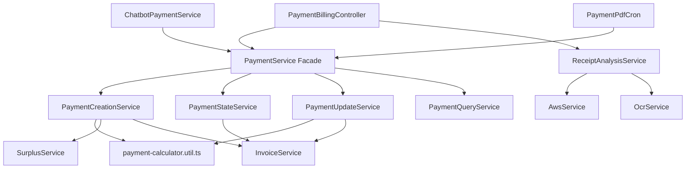

# Especificación de Diseño: Refactorización del Módulo de Pagos (`PaymentModule`)

**Fecha**: 2026-08-10  
**Módulo**: `billing/payments`  
**Estado**: En Revisión  

---

## 1. Contexto y Objetivos

El servicio principal `PaymentService` (`src/billing/payments/services/payment.service.ts`) ha alcanzado cerca de 750 líneas de código y acumula múltiples responsabilidades desconectadas:
1. Creación y cálculo de split de pagos (individuales y multi-factura) con transacciones manuales.
2. Gestión de estados de pagos (`approvePayment`, `rejectPayment`) y sincronización con excedentes (`Surplus`).
3. Modificación de pagos (`updatePaymentDate`) con recalculo de saldos y tasas de cambio.
4. Consultas y reportes (`findPayments`, `countPendingPayments`, `findUnsetPayment`, `markPaymentsAsSent`).
5. El controlador `PaymentBillingController` contiene lógica de negocio directa para el análisis OCR de recibos, llamadas a AWS S3 y mapeo de monedas.

### Objetivos:
- Aplicar principios de **Clean Architecture**, **DDD (Domain-Driven Design)** y **NestJS Best Practices** (`arch-single-responsibility`, `arch-feature-modules`, `db-use-transactions`).
- Descomponer el servicio monolítico en **5 sub-servicios de dominio especializados** y 1 helper de cálculo puro.
- Mantener `PaymentService` como una **Fachada (Facade)** delegada para garantizar 100% de retrocompatibilidad con el chatbot (`ChatbotPaymentService`), controladores, crons y tests existentes.
- Trasladar la lógica de negocio OCR del controlador a `ReceiptAnalysisService`.

---

## 2. Arquitectura Propuesta

---

## 3. Descomposición de Componentes

### 3.1. Utility Helpers (`src/billing/payments/utils/payment-calculator.util.ts`)
Funciones puras sin dependencias de TypeORM ni NestJS DI:
- `validateAmounts(dto, amount, amountExtracted)`: Validación de montos finitos positivos.
- `resolveAmountUsd(dto, amount, rateUsd)`: Conversión a USD según método de pago.
- `computePaymentSplit(...)`: Cálculo del split del pago entre la factura y el excedente (USD y Bs).

### 3.2. Sub-Servicios Especializados

1. **`PaymentCreationService`** (`src/billing/payments/services/payment-creation.service.ts`):
   - `createPayment`: Maneja pagos a facturas únicas y múltiples.
   - Resuelve tasas de cambio con fallback a fecha de operación.
   - Aplica bloqueo pesimista en facturas (`pessimistic_write`).
   - Calcula y persiste pagos y excedentes (`SurplusService`).
   - Soporta `QueryRunner` externo (inyección desde chatbot) o del contexto HTTP ALS.

2. **`PaymentStateService`** (`src/billing/payments/services/payment-state.service.ts`):
   - `approvePayment`: Transición a `COMPLETED`, reactivación de excedentes cancelados y recalculo de saldo pagado en factura. Decorado con `@Transactional()`.
   - `rejectPayment`: Transición a `REJECTED` con razón en metadatos, cancelación de excedentes pendientes y recalculo de factura. Decorado con `@Transactional()`.

3. **`PaymentUpdateService`** (`src/billing/payments/services/payment-update.service.ts`):
   - `updatePaymentDate`: Actualiza la fecha de un pago, recalcula tasa de cambio, split de montos y ajusta excedentes existentes o crea nuevos. Decorado con `@Transactional()`.

4. **`PaymentQueryService`** (`src/billing/payments/services/payment-query.service.ts`):
   - `findPayments`: Búsqueda paginada con filtros por estado, término de búsqueda (cédula, nombre, contrato, referencia) y período (mes/año).
   - `countPendingPayments`: Conteo de pagos pendientes (`PROCESSING`).
   - `findUnsetPayment`: Búsqueda de pagos completados pendientes de notificación.
   - `markPaymentsAsSent`: Actualización masiva de la marca de tiempo `sendAt`.

5. **`ReceiptAnalysisService`** (`src/billing/payments/services/receipt-analysis.service.ts`):
   - `analyzeReceipt`: Carga de archivo a S3, invocación de OCR, parseo de fecha en zona horaria Caracas y mapeo de moneda (USD/BS/VES) a método de pago (ZELLE, PAGO_MOVIL, TRANSFERENCIA).

### 3.3. Fachada Retrocompatible (`src/billing/payments/services/payment.service.ts`)
Reducido a ~60 líneas. Inyecta los 4 sub-servicios de pagos y delega las invocaciones manteniendo exactamente las mismas firmas de métodos.

### 3.4. Controlador Refactorizado (`src/billing/payments/controllers/payments-billing.controller.ts`)
- Inyecta `PaymentService` y `ReceiptAnalysisService`.
- `analyzeReceipt` se delega a `ReceiptAnalysisService.analyzeReceipt(file)`.

### 3.5. Módulo de Pagos (`src/billing/payments/payment.module.ts`)
Registra e incluye en `providers` y `exports`:
- `PaymentService`
- `PaymentCreationService`
- `PaymentStateService`
- `PaymentUpdateService`
- `PaymentQueryService`
- `ReceiptAnalysisService`
- `SurplusService`

---

## 4. Plan de Verificación y Pruebas

1. **Pruebas Unitarias**:
   - `payment-calculator.util.spec.ts`: Test unitarios puros para splits de pagos Zelle y no-Zelle con excedente.
   - `payment.service.spec.ts`: Adaptar las pruebas existentes para verificar el comportamiento a través de la fachada y los sub-servicios.
2. **Verificación de Compilación y Linting**:
   - Ejecutar `npm run build` o `npx tsc --noEmit` para garantizar la corrección de tipos TypeScript en todo el proyecto.
