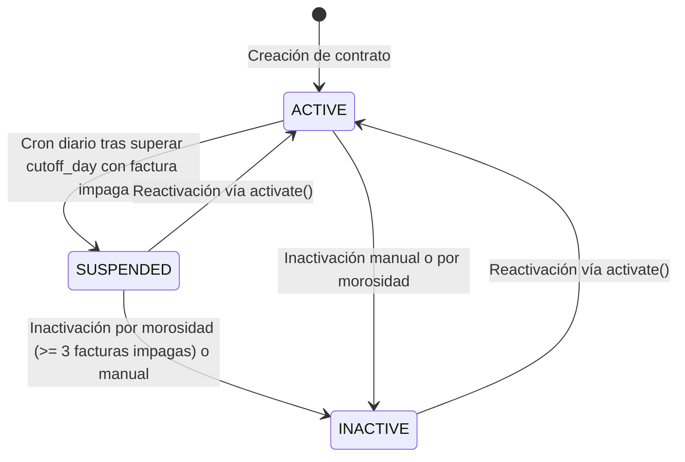

# Especificación de Diseño: Estado Suspendido y Día de Corte en Contratos

**Fecha**: 2026-09-03  
**Módulos**: `contracts`, `billing`, `reports`, `statistics`  
**Estado**: Aprobado por el usuario (Enfoque A - Aplicación integral a los 16 puntos del sistema)  

---

## 1. Contexto y Objetivos

Actualmente, los contratos en SIRCA manejan dos estados principales definidos en el enum `ContractStatus`: `ACTIVE` e `INACTIVE`. Cuando un cliente no paga sus facturas, se inactiva únicamente cuando acumula 3 o más facturas impagas a través del cron mensual `ContractInactivationCron`.

Se requiere incorporar un estado intermedio de **Suspensión** (`SUSPENDED`) y un **Día de Corte de Pago** (`cutoff_day`) personalizable por contrato con valor por defecto el día 5 de cada mes. Si un contrato activo supera su día de corte sin haber saldado su factura vencida, debe pasar automáticamente a estado suspendido.

Asimismo, se acordó explícitamente que los procesos operativos existentes (facturación mensual, aplicación de excedentes, inactivación por morosidad, reportes de cobranza, pipeline comercial y estadísticas) continúen contemplando de forma unificada tanto los contratos **`ACTIVE`** como los **`SUSPENDED`**, limitando la suspensión a afectar únicamente futuros procesos (por ejemplo, autorizaciones médicas y consumos de servicios clínicos).

### Objetivos Principales:
1. **Nuevo Estado en Contrato**: Agregar `SUSPENDED` a `ContractStatus` tanto a nivel de código como en el tipo `enum` de PostgreSQL.
2. **Día de Corte Personalizable**: Agregar la columna `cutoff_day` (`integer`, default 5, check constraint 1 a 31) en la tabla `contracts`.
3. **Cálculo de Vencimiento de Factura**: Alinear el `due_date` de las facturas con el `cutoff_day` del contrato para el mes correspondiente.
4. **Corte Automático Desacoplado (Enfoque A)**: Implementar un nuevo cron diario (`ContractSuspensionCron`) que suspenda contratos activos con facturas impagas vencidas.
5. **Continuidad Integral de Procesos (16 Puntos)**: Adaptar todas las consultas y validaciones del sistema para operar con `ACTIVE` y `SUSPENDED`.
6. **Reactivación Flexible**: Permitir que el método `activate()` en `ContractLifecycleService` reactive contratos tanto desde `INACTIVE` como desde `SUSPENDED`.
7. **Migración Controlada**: Generar y ejecutar la migración mediante `pnpm run migrations:generate`.

---

## 2. Diagrama de Estados del Contrato



---

## 3. Cambios en el Modelo de Datos (PostgreSQL & TypeORM)

### 3.1. Entidad `Contract` (`src/contracts/entities/contract.entity.ts`)

```typescript
export enum ContractStatus {
  ACTIVE = 'ACTIVE',
  INACTIVE = 'INACTIVE',
  SUSPENDED = 'SUSPENDED',
}

@Entity('contracts')
@Index('IDX_contracts_status', ['status'])
@Check('CHK_contracts_cutoff_day', '"cutoff_day" >= 1 AND "cutoff_day" <= 31')
export class Contract {
  // ... campos existentes ...

  @Column({
    type: 'int',
    default: 5,
    name: 'cutoff_day',
  })
  cutoffDay: number;

  @Column({ type: 'enum', enum: ContractStatus, default: ContractStatus.ACTIVE })
  status: ContractStatus;
}
```

### 3.2. DTOs de Contrato
Actualizar los DTOs para aceptar `cutoffDay` opcional con validación de tipo y rango:
- `CreateContractDto` (`src/contracts/dto/create-contract.dto.ts`)
- `CreateContractFullDto` (`src/contracts/dto/create-contract-full.dto.ts`)
- `UpdateContractDto` (`src/contracts/dto/update-contract.dto.ts`)

```typescript
@IsOptional()
@IsInt({ message: 'El día de corte debe ser un número entero' })
@Min(1, { message: 'El día de corte debe ser al menos 1' })
@Max(31, { message: 'El día de corte no puede ser mayor a 31' })
cutoffDay?: number;
```

### 3.3. Migración TypeORM
La migración generada mediante `pnpm run migrations:generate` aplicará en PostgreSQL:
```sql
ALTER TYPE "public"."contracts_status_enum" ADD VALUE IF NOT EXISTS 'SUSPENDED';
ALTER TABLE "contracts" ADD "cutoff_day" integer NOT NULL DEFAULT 5;
ALTER TABLE "contracts" ADD CONSTRAINT "CHK_contracts_cutoff_day" CHECK ("cutoff_day" >= 1 AND "cutoff_day" <= 31);
```

---

## 4. Cron de Suspensión y Modificación de los 16 Puntos del Sistema

### 4.1. Cron Diario de Suspensión (`ContractSuspensionCron`)
* **Archivo**: `src/contracts/crons/contract-suspension.cron.ts`
* **Frecuencia**: `@Cron('0 1 * * *')` (Diario a la 1:00 AM hora de Caracas).
* **Lógica**:
  1. Consulta en lotes de 100 contratos con `status = ContractStatus.ACTIVE`.
  2. Determina la fecha actual en Caracas (`getCaracasNow()`).
  3. Para cada contrato, evalúa si hoy es posterior a su día de corte del mes en curso (`now.day > contract.cutoffDay`).
  4. Si superó el corte, consulta si tiene facturas impagas (`status IN ('PENDING', 'PARTIAL')`) cuya fecha de vencimiento (`dueDate`) sea menor o igual a la fecha de corte o fecha actual.
  5. En una transacción atómica por contrato (QueryRunner):
     * Actualiza el estado a `ContractStatus.SUSPENDED`.
     * Establece `inactivationReason = 'Suspendido automáticamente por corte de pago sin saldar (Día ' + contract.cutoffDay + ')'`.
  6. Emite logs estructurados con el resumen de contratos suspendidos.

---

### 4.2. Mapeo Exhaustivo de los 16 Puntos del Sistema (Todos adaptados a `ACTIVE` y `SUSPENDED`)

#### 📦 Facturación y Pagos (`Billing`)
1. **`src/billing/crons/generate-monthly-invoices.cron.ts` (Línea 36)**
   * Cambio: `where: { status: In([ContractStatus.ACTIVE, ContractStatus.SUSPENDED]) }`
   * Efecto: Los contratos suspendidos reciben factura mensual el día 25.
2. **`src/billing/invoices/services/invoice-generation.service.ts` (Línea 78)**
   * Cambio: `if (preContract.status !== ContractStatus.ACTIVE && preContract.status !== ContractStatus.SUSPENDED)`
   * Efecto: Permite generar facturas tanto para contratos activos como suspendidos.
   * Adicional: Cálculo de `dueDate` a partir de `contract.cutoffDay` y el mes de facturación.
3. **`src/billing/payments/services/surplus.service.ts` (Línea 204)**
   * Cambio: `where: { status: In([ContractStatus.ACTIVE, ContractStatus.SUSPENDED]) }`
   * Efecto: Los saldos a favor se aplican a facturas vencidas de contratos suspendidos para regularizar su deuda.
4. **`src/billing/crons/contract-inactivation.cron.ts` (Línea 50)**
   * Cambio: `where: { status: In([ContractStatus.ACTIVE, ContractStatus.SUSPENDED]), ... }`
   * Efecto: Los contratos suspendidos que acumulen 3 o más facturas impagas pasan a `INACTIVE` definitivo.

#### 👥 Contratos y Afiliaciones (`Contracts`)
5. **`src/contracts/services/contract-lifecycle.service.ts` (Línea 188)**
   * Cambio: `activate(contractId)` valida que no esté ya `ACTIVE`. Permite reactivar contratos tanto desde `INACTIVE` como desde `SUSPENDED` (limpiando `inactivationReason` y seteando `status = ACTIVE`).
6. **`src/contracts/services/contract-creation.service.ts` (Línea 128)**
   * Cambio: `contract: { status: In([ContractStatus.ACTIVE, ContractStatus.SUSPENDED]) }`
   * Efecto: Impide que una persona sea afiliada a un nuevo contrato si pertenece a un contrato suspendido con deuda pendiente.
7. **`src/contracts/services/contract-affiliation.service.ts` (Línea 118)**
   * Cambio: `contract: { status: In([ContractStatus.ACTIVE, ContractStatus.SUSPENDED]) }`
   * Efecto: Impide agregar como beneficiario a quien pertenezca a otro contrato activo o suspendido.

#### 🔍 Consultas y Pipeline (`Pipeline & Query Repository`)
8. **`src/contracts/repositories/contract-query.repository.ts` (Línea 36)**
   * Cambio: `qb.andWhere("contract.status IN ('ACTIVE', 'SUSPENDED')");` al filtrar por `stage`.
   * Efecto: Permite ver contratos en sus etapas de cobranza aunque estén suspendidos.
9. **`src/contracts/repositories/contract-query.repository.ts` (Línea 61)**
   * Cambio: `findContractsForPipeline()`: `qb.andWhere("contract.status IN ('ACTIVE', 'SUSPENDED')");`
   * Efecto: El asesor ve los contratos suspendidos en su embudo comercial/cobranzas.

#### 📊 Reportes (`Reports`)
10. **`src/reports/reports.service.ts` (Línea 59)**
    * Cambio: `contract: { status: In([ContractStatus.ACTIVE, ContractStatus.SUSPENDED]) }`
    * Efecto: El reporte detallado mensual incluye las facturas de contratos suspendidos.
11. **`src/reports/sip-commissions.service.ts` (Línea 187)**
    * Cambio: `WHERE c.status IN ('ACTIVE', 'SUSPENDED')`
    * Efecto: El asesor cobra su comisión si un contrato suspendido completa el pago de su factura.
12. **`src/reports/projection-report.service.ts` (Línea 113)**
    * Cambio: `WHERE c.status IN ('ACTIVE', 'SUSPENDED') AND c.deleted_at IS NULL`
    * Efecto: La proyección de ingresos de carteras contempla a los afiliados suspendidos como cartera por cobrar.

#### 📈 Estadísticas y Dashboard (`Statistics`)
13. **`src/statistics/services/statistics.service.ts` (Línea 91)**
    * Cambio: `AND c.status IN ('ACTIVE', 'SUSPENDED')` (Facturas verificadas y por verificar).
14. **`src/statistics/services/statistics.service.ts` (Línea 153)**
    * Cambio: `WHERE c.status IN ('ACTIVE', 'SUSPENDED')` (Resumen global de facturación mensual).
15. **`src/statistics/services/statistics.service.ts` (Línea 189)**
    * Cambio: `WHERE c.status IN ('ACTIVE', 'SUSPENDED')` (Tendencia de cobranza de 12 meses).
16. **`src/statistics/services/statistics.service.ts` (Línea 216)**
    * Cambio: `AND c.status IN ('ACTIVE', 'SUSPENDED')` (Total de afiliados facturados).

---

## 5. Plan de Verificación

1. **Pruebas Unitarias**:
   * Test de `ContractSuspensionCron`: verificar que contratos con `cutoffDay` vencido e impagos se suspendan, y contratos al día o sin corte cumplido se mantengan activos.
   * Test de `ContractLifecycleService.activate`: verificar reactivación exitosa desde `SUSPENDED` a `ACTIVE`.
   * Test de `InvoiceGenerationService`: verificar que la fecha de vencimiento (`dueDate`) tome el `cutoffDay` del contrato.
   * Actualizar suites de tests existentes que asumen únicamente `ContractStatus.ACTIVE`.
2. **Generación de Migración**:
   * Ejecutar `pnpm run migrations:generate src/database/migrations/add-suspended-status-and-cutoff-day-to-contracts`.
   * Verificar el SQL emitido para asegurar consistencia del tipo enum en PostgreSQL y el constraint `CHK_contracts_cutoff_day`.
   * Ejecutar `pnpm run migrations:run` para aplicar los cambios a la base de datos.
3. **Chequeos de Calidad**:
   * Ejecutar `pnpm run check-types` para verificar ausencia de errores de tipado en TypeScript.
   * Ejecutar `pnpm run lint` para garantizar adhesión a los estándares de estilo del proyecto.
