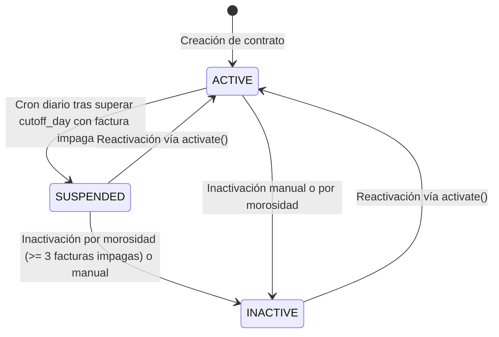

# Especificación de Diseño: Estado Suspendido y Día de Corte en Contratos

**Fecha**: 2026-09-03  
**Módulos**: `contracts`, `billing`  
**Estado**: Aprobado por el usuario (Enfoque A)  

---

## 1. Contexto y Objetivos

Actualmente, los contratos en SIRCA manejan dos estados principales definidos en el enum `ContractStatus`: `ACTIVE` e `INACTIVE`. Cuando un cliente no paga sus facturas, se inactiva únicamente cuando acumula 3 o más facturas impagas a través del cron mensual `ContractInactivationCron`.

Se requiere incorporar un estado intermedio de **Suspensión** (`SUSPENDED`) y un **Día de Corte de Pago** (`cutoff_day`) personalizable por contrato con valor por defecto el día 5 de cada mes. Si un contrato activo supera su día de corte sin haber saldado su factura vencida, debe pasar automáticamente a estado suspendido.

### Objetivos Principales:
1. **Nuevo Estado en Contrato**: Agregar `SUSPENDED` a `ContractStatus` tanto a nivel de código como en el tipo `enum` de PostgreSQL.
2. **Día de Corte Personalizable**: Agregar la columna `cutoff_day` (`integer`, default 5, check constraint 1 a 31) en la tabla `contracts`.
3. **Cálculo de Vencimiento de Factura**: Alinear el `due_date` de las facturas con el `cutoff_day` del contrato para el mes correspondiente.
4. **Corte Automático Desacoplado (Enfoque A)**: Implementar un nuevo cron diario (`ContractSuspensionCron`) que suspenda contratos activos con facturas impagas vencidas.
5. **Continuidad de Facturación**: Asegurar que los contratos en estado `SUSPENDED` sigan generando facturas en el cron del día 25 (`GenerateMonthlyInvoices`).
6. **Reactivación Flexible**: Permitir que el método `activate()` en `ContractLifecycleService` reactive contratos tanto desde `INACTIVE` como desde `SUSPENDED`.
7. **Migración Controlada**: Generar y ejecutar la migración mediante `pnpm run migrations:generate`.

---

## 2. Diagrama de Estados del Contrato



---

## 3. Cambios en el Modelo de Datos (PostgreSQL & TypeORM)

### 3.1. Entidad `Contract` (`src/contracts/entities/contract.entity.ts`)

```typescript
export enum ContractStatus {
  ACTIVE = 'ACTIVE',
  INACTIVE = 'INACTIVE',
  SUSPENDED = 'SUSPENDED',
}

@Entity('contracts')
@Index('IDX_contracts_status', ['status'])
@Check('CHK_contracts_cutoff_day', '"cutoff_day" >= 1 AND "cutoff_day" <= 31')
export class Contract {
  // ... campos existentes ...

  @Column({
    type: 'int',
    default: 5,
    name: 'cutoff_day',
  })
  cutoffDay: number;

  @Column({ type: 'enum', enum: ContractStatus, default: ContractStatus.ACTIVE })
  status: ContractStatus;
}
```

### 3.2. DTOs de Contrato
Actualizar los DTOs para aceptar `cutoffDay` opcional con validación de tipo y rango:
- `CreateContractDto` (`src/contracts/dto/create-contract.dto.ts`)
- `CreateContractFullDto` (`src/contracts/dto/create-contract-full.dto.ts`)
- `UpdateContractDto` (`src/contracts/dto/update-contract.dto.ts`)

```typescript
@IsOptional()
@IsInt({ message: 'El día de corte debe ser un número entero' })
@Min(1, { message: 'El día de corte debe ser al menos 1' })
@Max(31, { message: 'El día de corte no puede ser mayor a 31' })
cutoffDay?: number;
```

### 3.3. Migración TypeORM
La migración generada mediante `pnpm run migrations:generate` aplicará en PostgreSQL:
```sql
ALTER TYPE "public"."contracts_status_enum" ADD VALUE IF NOT EXISTS 'SUSPENDED';
ALTER TABLE "contracts" ADD "cutoff_day" integer NOT NULL DEFAULT 5;
ALTER TABLE "contracts" ADD CONSTRAINT "CHK_contracts_cutoff_day" CHECK ("cutoff_day" >= 1 AND "cutoff_day" <= 31);
```

---

## 4. Lógica del Corte y Servicios Afectados

### 4.1. Cron Diario de Suspensión (`ContractSuspensionCron`)
* **Archivo**: `src/billing/crons/contract-suspension.cron.ts`
* **Frecuencia**: `@Cron('0 1 * * *')` (Diario a la 1:00 AM hora de Caracas).
* **Lógica**:
  1. Consulta en lotes de 100 contratos con `status = ContractStatus.ACTIVE`.
  2. Determina la fecha actual en Caracas (`getCaracasNow()`).
  3. Para cada contrato, evalúa si hoy es posterior a su día de corte del mes en curso (`now.day > contract.cutoffDay`).
  4. Si superó el corte, consulta en la base de datos si tiene facturas impagas (`status IN ('PENDING', 'PARTIAL')`) cuya fecha de vencimiento (`dueDate`) sea menor o igual a la fecha de corte o fecha actual.
  5. En una transacción atómica por contrato (QueryRunner):
     * Actualiza el estado a `ContractStatus.SUSPENDED`.
     * Establece `inactivationReason = 'Suspendido automáticamente por corte de pago sin saldar (Día ' + contract.cutoffDay + ')'`.
  6. Emite logs estructurados con el resumen de contratos suspendidos.

### 4.2. Generación de Facturas Mensuales (`GenerateMonthlyInvoices`)
* **Archivo**: `src/billing/crons/generate-monthly-invoices.cron.ts`
* **Cambio**: Modificar la consulta de contratos para incluir tanto contratos activos como suspendidos:
  ```typescript
  where: { status: In([ContractStatus.ACTIVE, ContractStatus.SUSPENDED]) }
  ```
  De esta forma, un contrato suspendido continúa recibiendo la facturación mensual que le corresponde, acumulando deuda hasta que alcance las 3 facturas impagas requeridas para inactivación definitiva.

### 4.3. Cálculo de Vencimiento de Factura (`InvoiceGenerationService`)
* **Archivo**: `src/billing/invoices/services/invoice-generation.service.ts`
* **Cambio**: Al crear una factura para un período `billingMonth` (formato `YYYY-MM`), calcular `dueDate` según el `cutoffDay` del contrato:
  ```typescript
  const [yearStr, monthStr] = billingMonth.split('-');
  const year = parseInt(yearStr, 10);
  const month = parseInt(monthStr, 10);
  const daysInMonth = DateTime.local(year, month).daysInMonth ?? 28;
  const effectiveDay = Math.min(preContract.cutoffDay ?? 5, daysInMonth);
  const dueDate = DateTime.fromObject({ year, month, day: effectiveDay }, { zone: CARACAS_ZONE }).toJSDate();
  ```

### 4.4. Reactivación de Contrato (`ContractLifecycleService`)
* **Archivo**: `src/contracts/services/contract-lifecycle.service.ts`
* **Cambio en `activate(contractId)`**:
  * Permitir reactivación cuando `status === ContractStatus.SUSPENDED` o `status === ContractStatus.INACTIVE`.
  * Si el contrato ya está `ACTIVE`, lanzar `BadRequestException('El contrato ya se encuentra activo.')`.
  * Al pasar de `SUSPENDED` a `ACTIVE`, actualizar `status = ContractStatus.ACTIVE`, limpiar `inactivationReason = null`, y persistir.
  * Si viene de `INACTIVE`, mantener además la lógica existente de auditoría y desafiliaciones/afiliaciones en `AffiliationHistory`.

### 4.5. Inactivación de Contratos por Morosidad (`ContractInactivationCron`)
* **Archivo**: `src/billing/crons/contract-inactivation.cron.ts`
* **Cambio**: Evaluar para inactivación tanto contratos `ACTIVE` como `SUSPENDED` que alcancen el umbral de 3 o más facturas impagas:
  ```typescript
  where: {
    status: In([ContractStatus.ACTIVE, ContractStatus.SUSPENDED]),
    // ...
  }
  ```

---

## 5. Plan de Verificación

1. **Pruebas Unitarias**:
   * Test de `ContractSuspensionCron`: verificar que contratos con `cutoffDay` vencido e impagos se suspendan, y contratos al día o sin corte cumplido se mantengan activos.
   * Test de `ContractLifecycleService.activate`: verificar reactivación exitosa desde `SUSPENDED` a `ACTIVE`.
   * Test de `InvoiceGenerationService`: verificar que la fecha de vencimiento (`dueDate`) tome el `cutoffDay` del contrato.
2. **Generación de Migración**:
   * Ejecutar `pnpm run migrations:generate src/database/migrations/add-suspended-status-and-cutoff-day-to-contracts`.
   * Verificar el SQL emitido para asegurar consistencia del tipo enum en PostgreSQL y el constraint `CHK_contracts_cutoff_day`.
   * Ejecutar `pnpm run migrations:run` para aplicar los cambios a la base de datos.
3. **Chequeos de Calidad**:
   * Ejecutar `pnpm run check-types` para verificar ausencia de errores de tipado en TypeScript.
   * Ejecutar `pnpm run lint` para garantizar adhesión a los estándares de estilo del proyecto.
