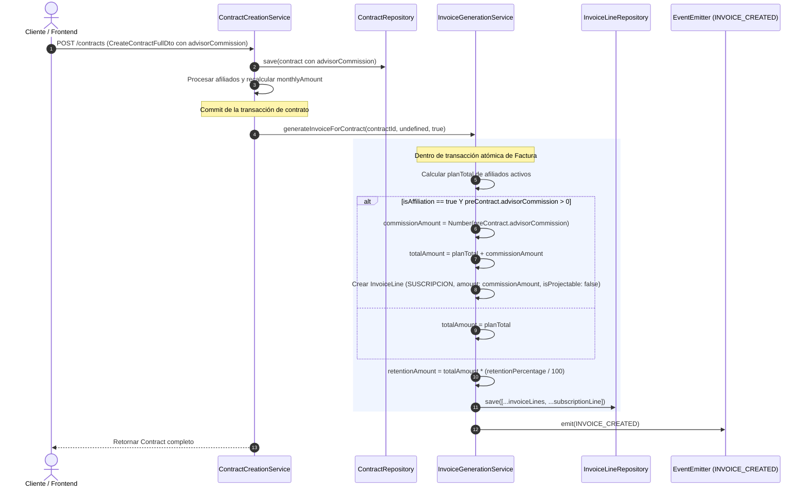

# Especificación de Diseño: Línea de Suscripción en Factura Inicial de Contrato

**Fecha**: 2026-09-25  
**Módulos**: `billing`, `contracts`  
**Estado**: Aprobado por el usuario  

---

## 1. Contexto y Objetivos

Al crear un contrato en SIRCA (`ContractCreationService.createFull`), opcionalmente se puede registrar una comisión (`advisorCommission`). Cuando esta comisión es enviada y posee un valor mayor a cero, el monto debe reflejarse automáticamente como una línea de suscripción (`SUSCRIPCION`) en la primera factura generada para dicho contrato (la factura de afiliación inicial generada con `isAffiliation = true`).

Actualmente, `InvoiceGenerationService.generateInvoiceForContract` solo genera líneas de tipo `INCLUSION` basadas en los planes de salud de los afiliados activos, ignorando por completo el campo `advisorCommission` del contrato. El objetivo es incorporar de manera atómica una línea adicional de categoría `SUSCRIPCION` cuando corresponda.

### Objetivos Principales:
1. **Inclusión de Suscripción en Factura Inicial**: Generar una `InvoiceLine` con categoría `InvoiceLineCategory.SUSCRIPCION` y monto igual a `preContract.advisorCommission` en la factura generada durante la afiliación (`isAffiliation === true`).
2. **Cálculo de Monto Total**: Ajustar `totalAmount` para que sume los planes de salud de los afiliados más el monto de la suscripción/comisión.
3. **Persistencia Atómica**: Garantizar que las líneas de afiliados y la línea de suscripción se creen y persistan en la misma transacción TypeORM.
4. **Idempotencia y Recálculo**: Asegurar que `InvoiceCalculationService.recalculateInvoiceAmountFromContract` conserve esta línea gracias a `isProjectable: false`.
5. **No Recurrencia**: Asegurar que la facturación mensual recurrente (`GenerateMonthlyInvoices` con `isAffiliation = false`) no agregue ni proyecte la línea de suscripción en meses posteriores.

---

## 2. Flujo de Datos y Lógica de Negocio



---

## 3. Especificación Técnica

### 3.1. Modificaciones en `InvoiceGenerationService`
**Archivo**: `src/billing/invoices/services/invoice-generation.service.ts`

1. **Cálculo de Comisión / Suscripción**:
   ```typescript
   const commissionAmount =
     isAffiliation && preContract.advisorCommission
       ? Number(preContract.advisorCommission)
       : 0;

   if (commissionAmount < 0 || !Number.isFinite(commissionAmount)) {
     throw new BadRequestException('El monto de la comisión del contrato no es válido');
   }
   ```

2. **Cálculo de `totalAmount`**:
   ```typescript
   const totalAmount = planTotal + commissionAmount;
   ```

3. **Creación de Línea de Suscripción**:
   Si `commissionAmount > 0`:
   ```typescript
   const subscriptionLine = qr.manager.create(InvoiceLine, {
     invoice: savedInvoice,
     category: InvoiceLineCategory.SUSCRIPCION,
     description: 'Cuota de suscripción',
     amount: commissionAmount,
     quantity: 1,
     person: null,
     plan: null,
     isProjectable: false,
   });
   ```

4. **Guardado conjunto**:
   ```typescript
   const linesToSave = subscriptionLine ? [...invoiceLines, subscriptionLine] : invoiceLines;
   await qr.manager.save(linesToSave);
   ```

---

## 4. Pruebas Unitarias

**Archivo**: `src/billing/invoices/tests/invoice-generation.service.spec.ts` (o nuevo archivo spec correspondiente)

1. **Debe incluir línea de suscripción**:
   - Contrato con `advisorCommission: 25`, `isAffiliation: true`.
   - Se deben guardar las líneas `INCLUSION` y una línea `SUSCRIPCION` de \$25.
   - `savedInvoice.totalAmount` debe incluir los \$25.
2. **Debe ignorar si comisión es 0 o null**:
   - Contrato con `advisorCommission: 0` o `null`, `isAffiliation: true`.
   - No genera línea de suscripción.
3. **Debe ignorar si no es afiliación**:
   - Contrato con `advisorCommission: 25`, `isAffiliation: false` (factura mensual normal).
   - No genera línea de suscripción.

---

## 5. Criterios de Aceptación
- Al invocar `createFull` con `advisorCommission > 0`, la factura inicial creada en BD tiene:
  - Una línea con `category = 'SUSCRIPCION'`.
  - `amount = advisorCommission`.
  - `is_projectable = false`.
  - `total_amount` de la factura = suma de planes + `advisorCommission`.
- Los tests unitarios pasan exitosamente con 100% de cobertura sobre el nuevo flujo.
